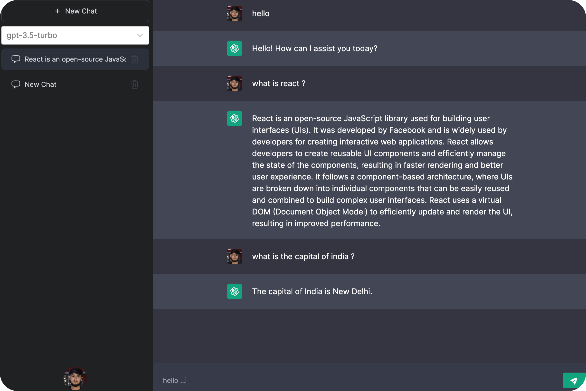

# ChatGPT Clone 



ChatGPT Clone is an AI-powered chat application that allows users to have natural and engaging conversations with an AI chatbot. This application is built upon the `GPT-3.5` language model and other openai models , which is capable of understanding and generating human-like text responses.

## Getting Started 

1. **Clone the Repository**: 
```bash 
git clone https://github.com/arunavabasu-03/chatgptclone.git
```

1. **Install Dependencies**: 

```bash 
cd chatgptclone  && yarn install
```

1. **Configure Environment Variables**: 
   
a. Run the command -  
```bash 
cp .env.sample .env
```
b. Setup the environment variables - 
```
OPENAI_API_KEY = "your_openai_api_key"

FIREBASE_WEB_CLIENT_ID = "your_firebase_web_client_id"
FIREBASE_WEB_CLIENT_SECRET_KEY = "your_firebase_web_client_secret_key"

NEXT_PUBLIC_FIREBASE_CONFIG_API_KEY = "your_firebase_config_api_key"
NEXT_PUBLIC_FIREBASE_CONFIG_AUTH_DOMAIN = "your_firebase_config_auth_domain"
NEXT_PUBLIC_FIREBASE_CONFIG_PROJECT_ID = "your_firebase_config_project_id"
NEXT_PUBLIC_FIREBASE_CONFIG_STORAGE_BUCKET = "your_firebase_config_storage_bucket"
NEXT_PUBLIC_FIREBASE_CONFIG_MESSAGING_SENDER_ID = "your_firebase_config_messaging_sender_id"
NEXT_PUBLIC_FIREBASE_CONFIG_APP_ID = "your_firebase_config_app_id"
NEXT_PUBLIC_FIREBASE_CONFIG_MEASUREMENT_ID = "your_firebase_config_measurement_id"

FIREBASE_SERVICE_ACCOUNT_KEY = "your_firebase_service_account_key_json"

NEXTAUTH_URL = "your_nextauth_url"
NEXTAUTH_SECRET = "your_nextauth_secret"

```

1. **Run the Application**: 

```bash
yarn dev
```

## Contributing

Contributions to the chatGPT Clone  project are welcome! If you have any suggestions, improvements, or feature requests, please feel free to open an issue or submit a pull request on the GitHub repository.


## License

This project is licensed under the MIT License .
